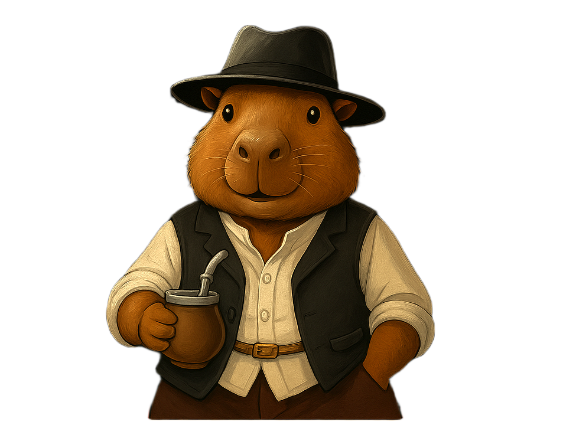
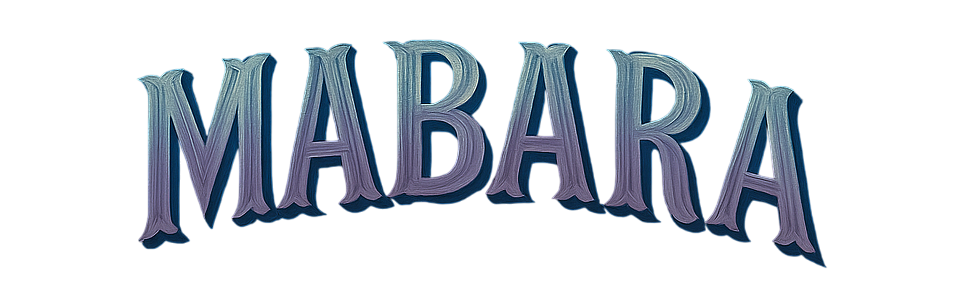

# Juan Manuel Rohr

### Datos Personales:

. Hola, soy Juan tengo 21 años vivo en Hurlingham Villa Tesei, tengo algo de experiencia programando principalmente
con JavaScript, HTML y CSS. Con estos lenguajes programé algunos bots de Discord y tambien paginas webs de prueba,
sin contar estos lenguajes tabien llegue a hacer uso de soluciones como Bootstrap y Wordpress.
Ahora quiero aprender a hacer una tienda online profecional para mi emprendimiento de corte y grabado laser MABARA,
siempre me gusto la programacion aunque soy Tecnico Electromecanico egresado de la Escuela Tecnica N2 de Tres de Febrero.

### Mas info:
- Me gusta mucho el mate y los carpinchos.
- Como dije antes tengo un emprendimiento jsjs (hace poquito) de corte y grabado laser
  donde hago artesanias y manualidades personalizadas y otras que hago yo, si les interesa
  pueden ver todo en "tr.ee/mabara" :)

